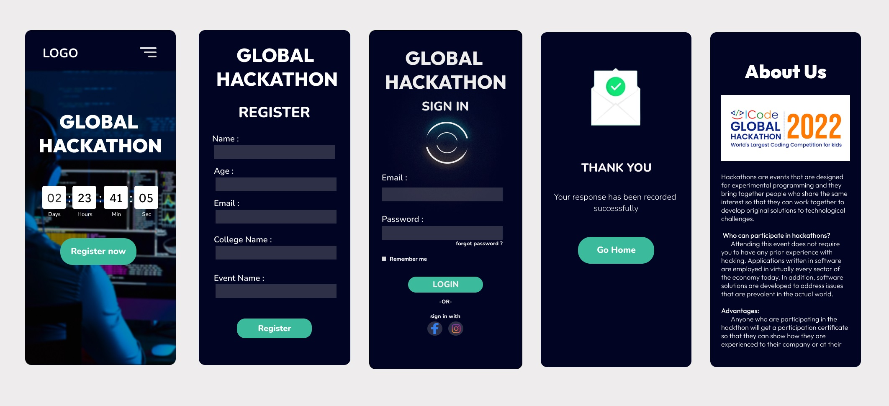

# Event Registration Web Application

## AIM:
To design, develop and deploy a web application for event registration.

## DESIGN STEPS:

### Step 1:
Choose a color palette and idea for the webpage with your team members.

### Step 2:
Open Figma and create a new project file and share the invite to your team members.

### Step 3:
Start making the UI design for web page.

### Step 4:
After completing the design export it to PDF.
### Step 6:

Publish the website in the given URL.

## DESIGN:

## Result:

The program to design, develop and deploy a web application for event registration is completed successfully.